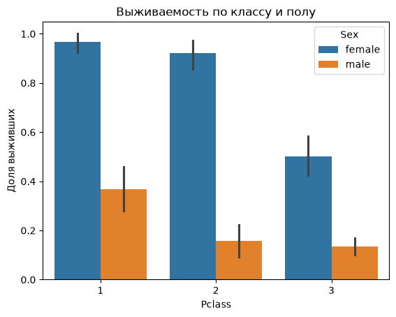

# Анализ выживаемости пассажиров Титаника

## Задача

Определить, какие факторы влияли на шанс выжить: пол, класс каюты, возраст.

## Ключевые находки

- Женщины выживали в 4 раза чаще мужчин (74.2% против 18.9%)
- Класс каюты усиливал этот эффект: женщина 1-го класса выживала почти всегда (96.8%),
  женщина 3-го класса — только в половине случаев (50%)
- Худшая позиция — мужчина 3-го класса: 13.5% выживших

## Инструменты
Python, pandas, seaborn, matplotlib

## Как воспроизвести
1. Установить зависимости: `pip install pandas seaborn matplotlib`
2. Открыть `titanic_analysis.ipynb`
3. Выполнить ячейки по порядку

## Источник данных
[Titanic dataset (datasciencedojo)](https://raw.githubusercontent.com/datasciencedojo/datasets/master/titanic.csv)

